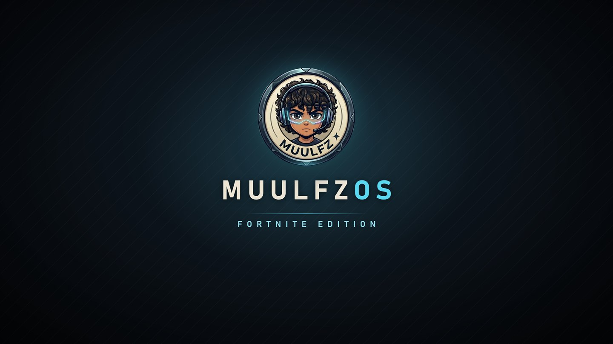

<p align="center"></p>

<h1 align="center">MuulfzOS · Fortnite Edition</h1>

<p align="center">An <a href="https://ameliorated.io">AME Wizard</a> playbook that tunes Windows 11 24H2 / 25H2 / 26H2 for competitive Fortnite<br>
and keeps everything Easy Anti-Cheat and Fortnite tournaments require.</p>

<p align="center"></p>

> **Status: 0.9.0 beta.** Every change has been checked in Hyper-V VMs on 25H2 and 26H2, and
> the anti-cheat invariants pass. It has not been verified on bare metal with Fortnite yet,
> because Easy Anti-Cheat refuses to run in a VM. Reports from real PCs are welcome.

## Guia rápido (PT-BR)

1. Baixe o **AME Wizard** em [ameliorated.io](https://ameliorated.io) e o arquivo `MuulfzOSFN-*.apbx` em [Releases](../../releases).
2. **No Windows atual:** arraste o `.apbx` para o AME e siga o assistente. Ele cria um ponto de restauração antes.
3. **Instalação limpa (pen drive):** no AME, arraste a ISO oficial do Windows 11 (baixe em microsoft.com) e depois o `.apbx`, e escolha *modificar ISO*. O AME pede o nome e a senha da sua conta, grava a ISO e você a coloca no pen drive com o Rufus ou o próprio AME.
4. No fim, abra o arquivo **"Fortnite - MuulfzOSFN.txt"** na área de trabalho. Ele mostra se o PC está pronto para torneios (Secure Boot, TPM, IOMMU) e as configurações do jogo que mais aliviam a CPU no endgame.

## What it changes

| Area | Change |
|---|---|
| **Performance** | **VBS / Memory Integrity off** (option, on by default: about 5-8% FPS). **Fortnite starts at High CPU priority** (IFEO `PerfOptions`, the only route that works under EAC). **Ultimate Performance** power plan on desktops; laptops keep Balanced, and dual-CCD Ryzen X3D has a Balanced option. **HAGS on.** **VRR and windowed-game optimizations on.** **Fast Startup off.** On desktops only: **hibernation off** and no link power saving on USB 3, PCIe and NVMe. |
| **Input** | **Mouse acceleration off.** The Sticky, Filter and Toggle Keys pop-up shortcuts are off. **Game Mode on.** Background "record what happened" capture is off; Game Bar itself stays. |
| **Network** | **NIC power saving off** (EEE, Green Ethernet, etc.), re-applied at every boot because driver updates reset it. **Receive buffers set to the driver maximum.** **Wi-Fi off while Ethernet is connected.** Delivery Optimization uses **HTTP only** (no P2P uploads). Fortnite's UDP traffic is **tagged DSCP 46** for routers that honour QoS. |
| **Background quiet** | **Telemetry off:** DiagTrack, policy, and about 14 telemetry/CEIP tasks. **No Windows Update restarts between 10:00 and 04:00.** **Outlook, Dev Home and Teams don't reinstall themselves.** No "Let's finish setting up" screens or suggestion toasts. **No OEM bloat:** firmware-injected installers (WPBT) and auto-installed mouse/monitor companion apps are blocked. **Quieter idle:** maintenance doesn't wake the PC, Game Bar's presence writer is off, and Edge startup boost is off. |
| **Debloat** | **AI:** Copilot, Recall, Click to Do, AI Hub, Writing Assistant, Edge Game Assist, and the AI in Paint, Notepad, Edge and Settings. **Bing, news and Widgets:** Bing Search/News/Weather and Widgets. **Office and productivity:** Outlook, Teams, To Do, Power Automate, Office Hub, Clipchamp. **Other apps:** Dev Home, Family, Quick Assist, Phone Link, Feedback Hub, Solitaire, Tips, Get Help, Sticky Notes, Alarms, Camera app, Sound Recorder. **OneDrive** is removed. **Kept:** Microsoft Store, Xbox app, Game Bar, Edge (WebView2). |
| **Optional** (off by default) | **Group services into fewer processes:** audio, network and Xbox stay separate. **Memory compression off:** 16 GB+ only. **Fault Tolerant Heap off.** |
| **Extras** (options) | **Epic Games Launcher**, official installer. **MuulfzOS wallpaper and lock screen.** **Setup notes on the desktop:** tournament readiness, third-party network filters found, and in-game settings. |

## What it keeps (anti-cheat and tournaments)

Since 2026-02-19, Fortnite PC tournaments require **Secure Boot + TPM 2.0 + IOMMU**. MuulfzOSFN
never touches any of these:

- Secure Boot, TPM/TBS and Measured Boot logs
- Windows Defender real-time protection, and the Microsoft Store
- Driver signature enforcement and the Vulnerable Driver Blocklist
- DEP, ASLR and the default exploit mitigations
- Windows Update itself
- Game Bar (dual-CCD Ryzen X3D needs it to pick the right cores)

Kernel shadow stacks are turned off, because they break EAC (error 1275).

## What it does not do, and why

These are popular tweaks that are left out on purpose: they are placebo, or they cost more than they give.

- **Nagle / TCP ack tweaks:** Fortnite matches run on UDP.
- **`bcdedit` timer flags, forced MSI mode:** no measured gain. Forced MSI mode can cause a BSoD.
- **`Win32PrioritySeparation`, MMCSS "Games" keys, `SystemResponsiveness`:** they give the same behaviour as the client default, or only affect audio threads.
- **Mouse/keyboard queue size:** with 4-8 kHz mice a smaller queue risks dropped input.
- **`NetworkThrottlingIndex`, packet coalescing, forcing RSS, interrupt moderation off:** placebo at Fortnite's packet rates. `NetworkThrottlingIndex=0xFFFFFFFF` can even lengthen network DPCs.
- **Disabling Defender, mitigations, SmartScreen, Teredo/IPv6, the TRIM task or Windows Update:** these break anti-cheat, security, Xbox party or SSD health.

**About endgame stutter:** when 50 players fight in a small area, the CPU spike comes from the game itself, which has to simulate and draw all of them. Handling the extra network packets is a tiny part of it. In the VM stress test, the Windows network stack used under 1% CPU at a heavy endgame's ~600 packets/s. The biggest lever left is the in-game settings below.

## Recommended in-game settings (endgame CPU)

- **Rendering Mode:** Performance
- **NVIDIA Reflex:** On + Boost
- **View Distance:** Near. **Shadows:** Off. **Effects:** Low. **Meshes:** Low.
- **Replays:** turn off all the *Record Replays* toggles.
- **Frame rate limit:** the fps you can hold in endgames, or your refresh rate − 3 with G-Sync/FreeSync.

## Measured results (Hyper-V VM, same host, 8 vCPU / 16 GB)

**Idle, 5 minutes after logon** (26H2, 3 clean boots each):

| | Stock 26H2 | MuulfzOSFN 0.1 | Change |
|---|---|---|---|
| Processes | 139 | 124 | −11% |
| RAM in use | 2,590 MB | 2,319 MB | −10.5% |
| Appx packages | 122 | 85 | −30% |
| Idle CPU | 3.2% | 2.1% | |
| Background network | ~1.5 MB/min | ~7 KB/min | |
| CPU throughput (7-Zip) | | | unchanged (±2%) |

- **First run of 0.9 (1 boot):** 121 processes and 2,339 MB, against 138 and 2,717 MB for stock in the same run.
- **0.9 with "group services":** 85 processes.
- **Stock with Memory Integrity (VBS) on:** boot takes 43 s instead of 22 s and idle RAM rises to 2,815 MB.
- **Network under endgame-style UDP load** (stock 26H2): 600 packets/s → ~1-4% CPU and ~1-4 ms p99 echo. 40,000 packets/s (download-like flood) → ~14% CPU and no loss.

A full 26H2 / 25H2 / AtlasOS comparison with game-engine FPS (Unigine Heaven through GPU partitioning) is in progress. The harness is in `tests/vm/bench-compare.ps1`.

These figures don't capture what counts most in a match: real FPS, 1% lows and network latency on your own hardware.

## Wizard options

| Page | Option | Default |
|---|---|---|
| Fortnite tuning | Disable VBS / Memory Integrity. Leave it on if you also play Valorant or FACEIT. | ✅ |
| | Start Fortnite at High CPU priority | ✅ |
| | Dual-CCD Ryzen X3D (7900/7950/9900/9950X3D): keep Balanced plan | ☐ |
| | Block driver updates from Windows Update | ☐ |
| Performance | Group services into fewer processes | ☐ |
| | Memory compression off (16 GB+ RAM) | ☐ |
| | Fault Tolerant Heap off | ☐ |
| Software and look | Install Epic Games Launcher | ✅ |
| | MuulfzOS wallpaper and lock screen | ✅ |

## Install

**Requirements:**
- Windows 11 x64: 24H2, 25H2 or 26H2 (build 26100 / 26200 / 26300)
- No pending updates
- Internet, if you want the Epic launcher installed

**Live, on your current Windows:**
1. Open AME Wizard.
2. Drag in `MuulfzOSFN-<version>.apbx` and follow the pages.
3. AME creates a restore point, applies the playbook and reboots.

**Clean install from USB:**
1. In AME Wizard, drag in the official Windows 11 ISO from [microsoft.com](https://www.microsoft.com/software-download/windows11), then the `.apbx`.
2. Choose to modify the ISO.
3. AME asks for the account to create. Use your own name and password.
4. Write the ISO to a USB stick and install.
5. BitLocker auto-encryption is disabled. The hardware checks stay on, because a PC that fails them can't play tournaments either.

## Build from source

You need [uv](https://docs.astral.sh/uv/), PowerShell 7 and 7-Zip.

```powershell
pwsh tools/build.ps1                                          # -> dist/MuulfzOSFN-fortnite.apbx
uv run --with pyyaml --with pytest python -m pytest tools     # playbook tests
```

- `playbook/` holds the YAML. `main-fortnite.yml` lists the includes, and `playbook-fortnite.conf` holds the wizard pages.
- `tests/vm/` is the Hyper-V test kit:
  - `new-test-vm.ps1` creates the VM.
  - `validate-fortnite.ps1` checks every tweak and the anti-cheat invariants.
  - `bench-compare.ps1` runs the A/B benchmark, with idle footprint, CPU, network, UDP stress and GPU-P game FPS.
  - `-SkipCpu` skips the all-core load.

## Credits

Research and comparisons: [AtlasOS](https://github.com/Atlas-OS/Atlas), [ReviOS](https://github.com/meetrevision/playbook),
[Win11Debloat](https://github.com/Raphire/Win11Debloat), [winutil](https://github.com/ChrisTitusTech/winutil),
[Sophia Script](https://github.com/farag2/Sophia-Script-for-Windows), [PC-Tuning](https://github.com/valleyofdoom/PC-Tuning),
[nohuto/win-config](https://github.com/nohuto/win-config) and FR33THY. AME Wizard is made by [Ameliorated](https://ameliorated.io).

MuulfzOS is not affiliated with Epic Games or Microsoft. Use at your own risk.

## License

[MIT](LICENSE) © 2026 Muulfz
